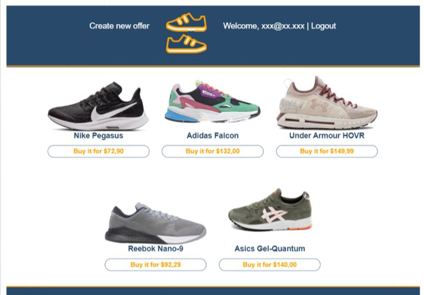

# Shoe shelf app

(Exam project) Project requirements for the app were to have Public (for unauthenticated users) and private parts, registration/login functionality, basic CRUD operations and validations. After registration, user can offer for sale or buy shoes from sorted list of public offers.

## Install

/Execute from project root directory/

Install project dependencies:
```
npm install
```
Start the app:
```
npx nodemon
```

Open in browser:
```
https://localhost:9999/home
```
## Basic dependencies
* Use Express.js as a back-end framework (^4.17.1)
* Use MongoDB as a database (^3.5.9)
* Use Mongoose for database modeling (^5.9.20)
* Use JWT to authenticate users (^8.5.1)
* Use Express-handlebars as view engine (^4.0.4)


